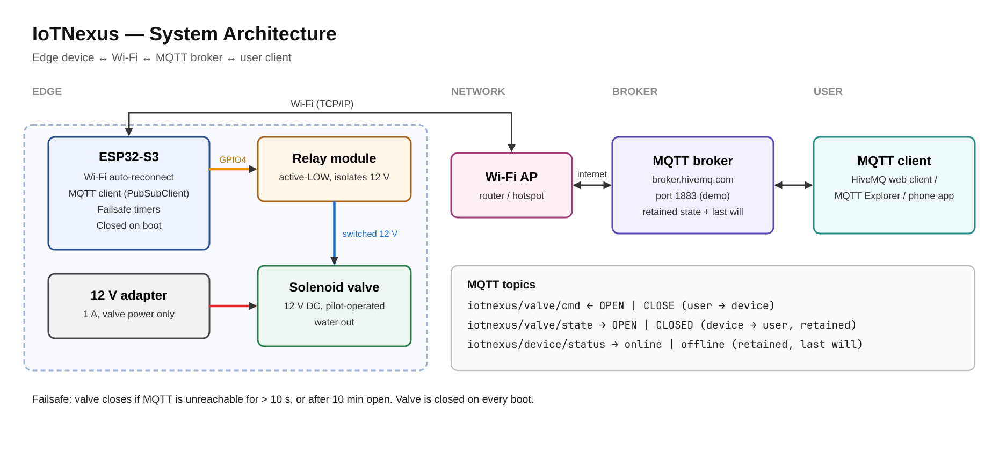

# IoTNexus — Remote Water Valve Controller

IoTrix 2.0 · Track A (Embedded IoT System)

ESP32-S3 firmware that opens and closes a 12 V solenoid water valve over MQTT, reports its state, and closes the valve automatically when the network is lost.

## Problem
<!-- TODO: replace with your team's problem statement and target user -->
Water valves are usually operated by hand, so someone has to be on site to turn water on or off. A valve left open by mistake, or a supply that keeps running during a fault, wastes water and can cause flooding. Existing manual setups give no way to check a valve's state remotely or to stop flow automatically when something goes wrong.

## Proposed solution
A Wi-Fi connected valve controller. An ESP32-S3 drives a relay that switches a 12 V solenoid valve. Users send `OPEN` / `CLOSE` commands through an MQTT broker and see the live valve state. Safety is built into the device itself: the valve closes on boot, when the connection is lost, and after a maximum open time, so a network fault never leaves water running.

## Architecture


| Layer | Component | Role |
|---|---|---|
| Edge | ESP32-S3 + relay + solenoid valve | Actuation, failsafe logic |
| Network | Wi-Fi (2.4 GHz) | Device connectivity |
| Broker | MQTT (`broker.hivemq.com`, port 1883) | Message routing, retained state, last will |
| User | Any MQTT client | Send commands, view state |

Wiring and pinout: [docs/wiring.md](docs/wiring.md)

### MQTT interface
| Topic | Direction | Payload | Notes |
|---|---|---|---|
| `iotnexus/valve/cmd` | user → device | `OPEN` / `CLOSE` | Case-insensitive. Send without the retain flag. |
| `iotnexus/valve/state` | device → user | `OPEN` / `CLOSED` | Retained, published on every change and on reconnect |
| `iotnexus/device/status` | device → user | `online` / `offline` | Retained; `offline` is the broker's last will |

### Why MQTT over HTTP
- Publish/subscribe: the device needs no public IP or open port, it only makes an outbound connection.
- Commands are pushed to the device instantly instead of polled.
- Retained messages and last will give the user the current state and online status without extra code.
- Small packets and a persistent connection suit a microcontroller.

## Current progress
| Feature | Status |
|---|---|
| Relay drives 12 V valve from GPIO4 | Working, tested |
| Valve hardware validated (orientation, pressure) | Done, see [TESTING.md](TESTING.md) |
| Wi-Fi with auto-reconnect | Implemented |
| MQTT open/close + state reporting | Implemented |
| Failsafe: close on connection loss / max open time / boot | Implemented |
| Wiring schematic and architecture diagram | Done |

## Technology stack
| Area | Choice |
|---|---|
| Microcontroller | ESP32-S3 DevKitC-1 |
| Actuator | 1-channel active-LOW relay module, 12 V DC pilot-operated solenoid valve |
| Power | USB for ESP32, separate 12 V 1 A adapter for the valve |
| Firmware | C++, Arduino framework, PlatformIO |
| Libraries | `WiFi` (ESP32 core), `PubSubClient` 2.8 |
| Protocol | MQTT 3.1.1 over TCP |
| Broker | HiveMQ public broker (demo) |

## Testing
Full log: [TESTING.md](TESTING.md). Key results:
- Pulsed leaking was traced to the valve being fitted against its flow arrow, not to firmware.
- The valve is pilot-operated: it opens fully on a high-pressure supply but household tap pressure is not enough.
- Relay switching and 12 V supply were verified separately by bypass tests.

## Limitations & risks
- **Public broker, no authentication:** anyone who knows the topic can control the valve. Fine for a demo only.
- **No TLS:** traffic is unencrypted on port 1883.
- **Pressure requirement:** the current valve does not open on low-pressure or gravity-fed supplies.
- **Failsafe delay:** if the broker disappears silently, detection waits for the MQTT keepalive (~15 s), so the valve may stay open 10–25 s.
- **No flow feedback:** the device knows what it commanded, not whether water is actually flowing.
- **No flyback diode yet** across the valve coil.

## Next steps (before the final)
1. Private broker with username/password and TLS.
2. Flow or water-level sensor to confirm real flow and detect leaks.
3. Direct-acting (zero-pressure) valve or pump for low-pressure sites.
4. Simple web/mobile dashboard.
5. Fit the 1N4007 flyback diode and measure the valve's minimum opening pressure.

## Build & flash
1. Install VS Code with the PlatformIO extension.
2. Copy `include/secrets.example.h` to `include/secrets.h` and fill in Wi-Fi and broker details.
3. Connect the ESP32-S3 by USB, then run `pio run -t upload`.
4. Open the serial monitor at 115200 baud: `pio device monitor`.

## Repository layout
```
src/main.cpp              firmware
include/secrets.example.h config template (secrets.h is git-ignored)
docs/architecture.png     system architecture diagram
docs/schematic.png        wiring schematic
docs/wiring.md            pinout and wiring tables
TESTING.md                test log and findings
platformio.ini            build config
```
