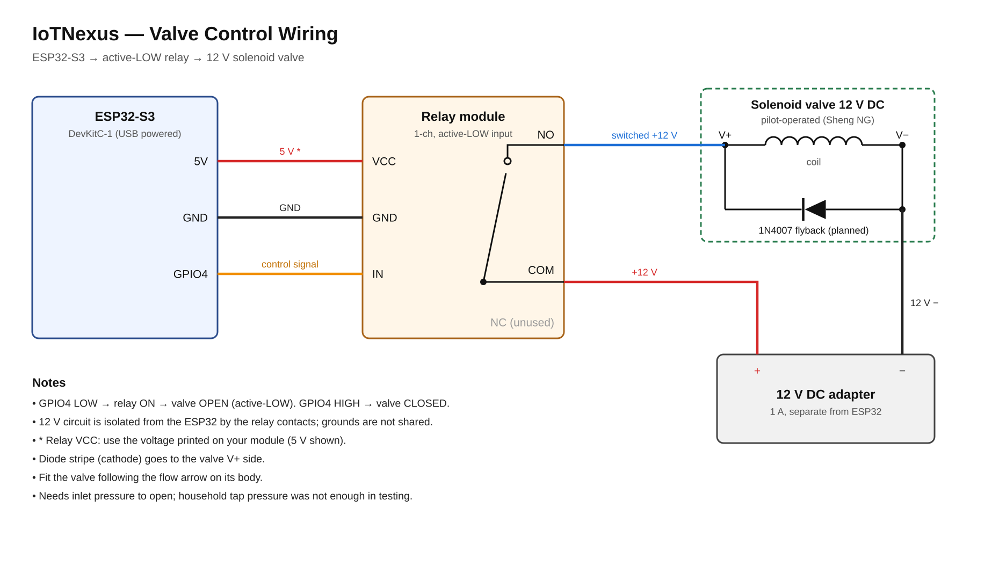

# Wiring & Pinout

## ESP32-S3 → Relay module (low-voltage side)

| ESP32-S3 pin | Relay pin | Wire | Purpose |
|---|---|---|---|
| 5V | VCC | red | Relay coil supply (use the voltage printed on the module) |
| GND | GND | black | Common ground for the control side |
| GPIO4 | IN | orange | Control signal, active-LOW |

## Relay → Valve → 12 V adapter (power side)

| From | To | Wire | Purpose |
|---|---|---|---|
| Adapter + (12 V) | Relay COM | red | Supply into the switch |
| Relay NO | Valve V+ | blue | Switched +12 V, live only when relay is ON |
| Valve V− | Adapter − | black | Return |
| 1N4007 across valve | stripe to V+, other end to V− | — | Flyback protection (planned) |

## Control logic

| GPIO4 | Relay | Valve |
|---|---|---|
| LOW | ON (clicks in) | OPEN |
| HIGH | OFF | CLOSED |

## Power

| Rail | Source | Load |
|---|---|---|
| 5 V / 3.3 V | USB into ESP32-S3 | ESP32, relay module input |
| 12 V DC | 12 V 1 A adapter | Solenoid valve coil only |

The 12 V circuit only passes through the relay contacts, so it stays electrically isolated from the ESP32. The two grounds are not connected.

## Installation notes
- Fit the valve with water flowing in the direction of the arrow on its body. Fitted backwards, it leaks in pulses and will not open (see [TESTING.md](../TESTING.md)).
- The valve is pilot-operated and needs inlet pressure to open. Household tap pressure was not enough in testing.
